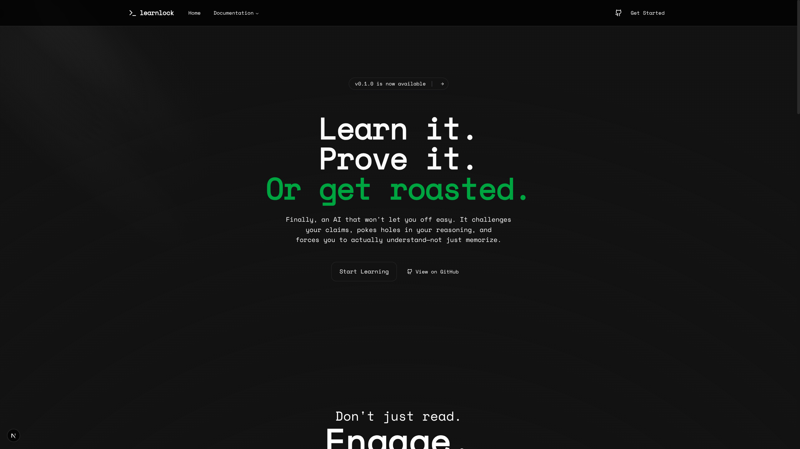
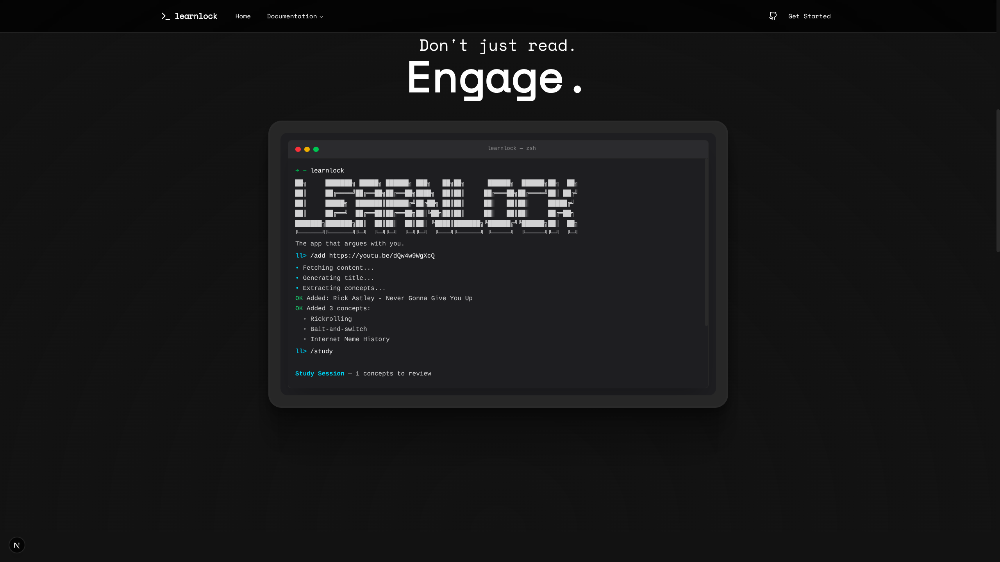

# LearnLock Documentation Site

The official documentation website for **LearnLock** - the CLI tool that uses adversarial Socratic dialogue to expose gaps in your understanding.



## 🚀 Overview

This site is built with **Next.js 16**, **Tailwind CSS v4**, and **Framer Motion**. It features a "brutal", terminal-inspired aesthetic designed to match the CLI tool's identity.

### Key Features
- **Terminal Demo:** An interactive, typing-effect CLI simulation on the landing page.
- **Scroll Animations:** Immersive `ContainerScroll` and `CardSpotlight` effects.
- **Responsive Design:** Fully mobile-optimized with a custom `Sheet` sidebar.
- **Dark Mode:** Native dark-mode-first design system.



## 🛠️ Tech Stack

- **Framework:** [Next.js 16](https://nextjs.org/) (App Router)
- **Styling:** [Tailwind CSS 4](https://tailwindcss.com/)
- **Animation:** [Framer Motion](https://www.framer.com/motion/)
- **Components:** [Radix UI](https://www.radix-ui.com/) & Custom "Brutal" Blocks
- **Icons:** [Lucide React](https://lucide.dev/)

## 🏃‍♂️ Getting Started

### Prerequisites
- Node.js 18+
- npm or pnpm

### Installation

1. Navigate to the directory:
   ```bash
   cd docs-site
   ```

2. Install dependencies:
   ```bash
   npm install
   ```

3. Run the development server:
   ```bash
   npm run dev
   ```

Open [http://localhost:3000](http://localhost:3000) with your browser to see the result.

## 🏗️ Building for Production

To create an optimized production build (suitable for Vercel/Netlify):

```bash
npm run build
```

This generates a `.next` folder with the compiled application.

## 📂 Project Structure

```
docs-site/
├── public/             # Static assets (images, icons)
├── src/
│   ├── app/            # Next.js App Router pages
│   │   ├── docs/       # Documentation markdown/pages
│   │   ├── layout.tsx  # Root layout with Navbar
│   │   └── page.tsx    # Landing page
│   ├── components/
│   │   ├── blocks/     # High-level UI sections (Hero, Navbar)
│   │   ├── landing/    # Landing page specific (TerminalDemo)
│   │   └── ui/         # Reusable atoms (Buttons, Inputs, etc.)
│   └── lib/            # Utilities and navigation config
└── tailwind.config.ts  # Style configuration
```

## 🎨 Design Philosophy

The site follows a strict "Terminal Brutalism" guide:
- **Colors:** Deep blacks (`#0a0a0a`), muted grays (`#27272a`), and neon accents (Cyan/Green).
- **Typography:** Clean Sans-serif for UI, Monospace for code/terminal elements.
- **Vibe:** "Stop consuming. Start retaining." - The UI is sharp, direct, and focused.

---

[Visit the Repository](https://github.com/MitudruDutta/learnlock)